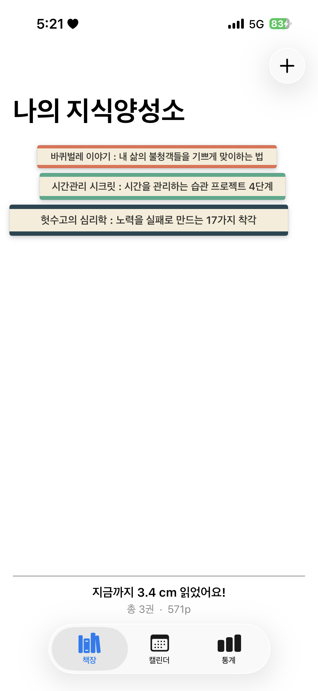
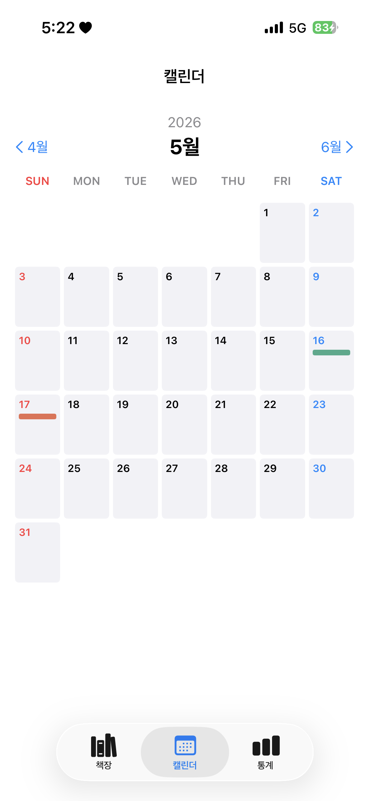
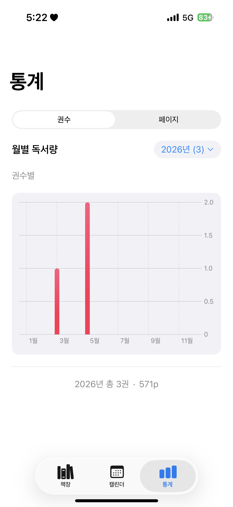
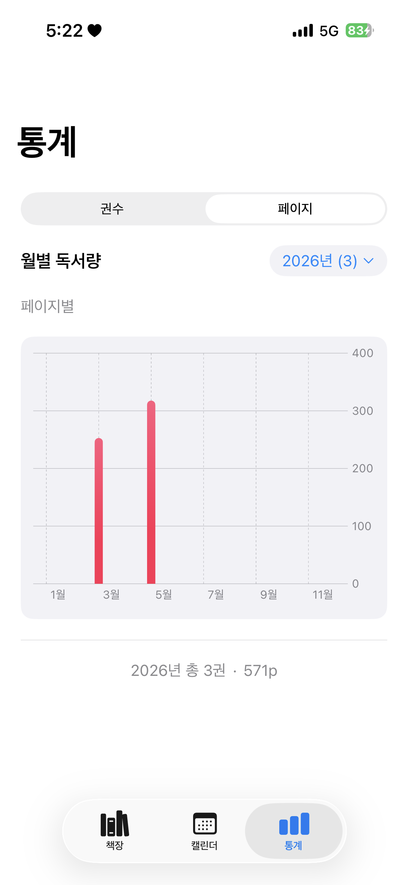

# 나의 지식양성소

읽은 책을 책장에 쌓듯이 기록하는 iOS 앱.

## 📱 스크린샷

<p align="center">
  
  
  
  
</p>

## Xcode 프로젝트 셋업

1. **Xcode 열기 → File ▸ New ▸ Project**
2. **iOS ▸ App** 템플릿 선택
3. 옵션
   - Product Name: `BookClub` (앱 표시 이름은 따로 설정)
   - Interface: **SwiftUI**
   - Language: **Swift**
   - Storage: **SwiftData** 체크
   - Including Tests: 취향대로
4. 저장 위치: `/Users/jimin/Dev/BookClub/` 안에 만들면 됨
   - 이미 만들어진 `Sources/` 폴더와 같은 레벨에 `BookClub.xcodeproj`가 생기게
5. **Deployment Target: iOS 18.0** 으로 변경
   - Project ▸ Target ▸ General ▸ Minimum Deployments
6. **표시 이름** 변경
   - Target ▸ Info ▸ `Bundle display name`(없으면 키 추가) = `나의 지식양성소`
7. Xcode가 만든 기본 파일들 정리
   - `BookClubApp.swift`, `ContentView.swift`, `Item.swift` 같은 보일러플레이트 **삭제**
   - 이미 `Sources/App/BookClubApp.swift`에 같은 이름의 `@main` struct가 있어서 충돌남
8. **Sources 폴더 드래그**
   - Finder에서 `Sources/` 폴더를 Xcode의 프로젝트 네비게이터로 드래그
   - "Create groups" 선택, "Add to targets: BookClub" 체크
9. **Cmd+R 빌드**

## 파일 구조

```
Sources/
├── App/
│   ├── BookClubApp.swift      @main, SwiftData 컨테이너 주입
│   └── RootTabView.swift       하단 탭바 (책장/캘린더/통계)
├── Models/
│   ├── Book.swift              @Model — 책 한 권
│   └── BookPalette.swift       랜덤 색상 팔레트
├── Common/
│   ├── Color+Hex.swift         hex → Color 변환
│   └── PageThickness.swift     페이지 수 → 책 높이 (5단계)
└── Features/
    ├── Bookshelf/              메인 책장 (최신순, 책등 스택)
    ├── AddBook/                책 + 리뷰 추가
    ├── BookDetail/             상세 + 편집 + 삭제
    ├── Calendar/               월별 캘린더 (책등 색 미니어처)
    └── Stats/                  권수/페이지 토글 막대 그래프
```

## 디자인 결정 요약

| 항목 | 값 |
|------|----|
| 앱 이름 | 나의 지식양성소 |
| 최소 iOS | 18.0 |
| 데이터 저장 | SwiftData (로컬) |
| 책 색상 | 추가 시 랜덤, 고정 |
| 정렬 | 완독일 최신순 |
| 페이지 단계 | 5단계 (~100 / ~200 / ~300 / ~500 / 500+) |
| 책등 텍스트 | 제목만, 1~2줄, 자동 폰트 축소 |
| 삭제 | 편집 화면 하단 → 확인 alert |
| 다크모드 | 시스템 따라감 |

## 다음 단계 (해보면 좋을 것)

- iCloud 동기화 (CloudKit + SwiftData)
- 책 표지 이미지 추가
- 별점 / 태그
- 캘린더 셀 탭 → 그 날 책 상세로 이동
- 위젯
